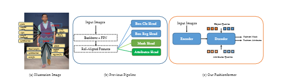
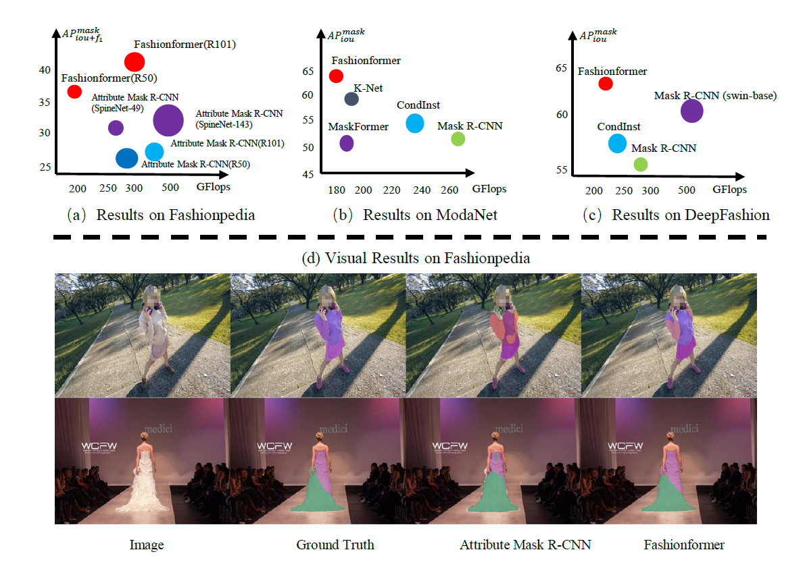

# Fashionformer ECCV-2022  [Video](https://github.com/xushilin1/FashionFormer/raw/main/video_poster/2087.mp4),[Poster](https://github.com/xushilin1/FashionFormer/raw/main/video_poster/ECCV22_poster_2087.pdf)
[A simple, effective and unified baseline for human fashion segmentation and recognition (ECCV 2022)](https://arxiv.org/abs/2204.04654)

Shilin Xu*,
[Xiangtai Li*](https://lxtgh.github.io/),
[Jingbo Wang](http://wangjingbo.top/),
[Guangliang Cheng](https://scholar.google.com/citations?user=FToOC-wAAAAJ),
[Yunhai Tong](https://www.cis.pku.edu.cn/info/1177/1371.htm),
[Dacheng Tao](https://scholar.google.com/citations?user=RwlJNLcAAAAJ&hl=zh-CN).



## Introduction
We present a simple, effective, unified baseline for fashion segmentation and attribute recognition. The figure below shows that the entire architecture is the Encoder-Decoder framework, like DETR.

This codebase also contains the implementation of [MaskAttribute-RCNN](https://arxiv.org/abs/2004.12276).



Fashionformer achieve new state-of-the-art results on three fashion segmentation datasets.


### Requirements
We adopt the [Open-MMLab](https://github.com/open-mmlab) codebase and use the specific version of mmdetection and mmcv. 
To run this code, make sure you have mmcv and mmdet in your environment.

- Python=3.8.13, CUDA=11.1
- PyTorch=1.9.0, torchvision=0.10.0
- mmcv==1.3.18 (full version, need CUDA extension)
- mmdet==2.18.0

## DataSet  

### Fashionpedia Dataset
### Images
- [Training images](https://s3.amazonaws.com/ifashionist-dataset/images/train2020.zip)
- [Validation and test images](https://s3.amazonaws.com/ifashionist-dataset/images/val_test2020.zip)

#### Annotations

**Detection: apparel object instance segmentation with localized attributes prediction:**

- [instances_attributes_train2020](https://s3.amazonaws.com/ifashionist-dataset/annotations/instances_attributes_train2020.json)
- [instances_attributes_val2020](https://s3.amazonaws.com/ifashionist-dataset/annotations/instances_attributes_val2020.json)
- [test_images_info2020](https://s3.amazonaws.com/ifashionist-dataset/annotations/info_test2020.json)

**Global attributes prediction**:

- [attributes_train2020](https://s3.amazonaws.com/ifashionist-dataset/annotations/attributes_train2020.json)
- [attributes_val2020](https://s3.amazonaws.com/ifashionist-dataset/annotations/attributes_val2020.json)
- test_images_info2020: same as detection task (Not used)

```
path/to/Fashionpedia/
├── annotations/  # annotation json files
│   ├── attributes_train2020.json
│   ├── attributes_val2020.json
│   ├── instances-attributes_train2020.json
│   ├── instances-attributes_val2020.json
└── train/
└── test/
│   ├── train2017/    # train images
│   ├── val2017/      # val images
│   └── test2017/     # test images
```

### ModaNet

Please see the details of this [link](https://github.com/eBay/modanet). 

### DeepFashion 

Please use the default setting by mmdetection. 


### Training and Testing
#### Training
```bash
# for single machine 
./tools/dist_train.sh $config $num_gpu
# for multi machine with slurm
./tools/slurm_train.sh $partition $job_name $config $work_dir
```
#### Testing
```bash
# for single machine 
./tools/dist_test.sh $config $checkpoint $num_gpu --eval segm
# for multi machine with slurm
./tools/slurm_test.sh $partition $job_name $config $checkpoint --eval segm
```

### Demo Visulization
```bash
python demo/image_demo.py $img $config $checkpoint
```

### Trained Model

We give the config to reproduce the Fashionformer and Mask-Attributes Mask-RCNN.

#### Fashionpedia 

Fashionformer CheckPoints [one drive](https://1drv.ms/u/s!Ai4mxaXd6lVBcAWlLG9x3sx8cKY?e=cBZdNy) and [baidu yun](https://pan.baidu.com/s/1wdG_QsNWHkgGbqWJYouVcw) Access Code: uvlc; 

### Acknowledgement

We build our codebase based on K-Net and mmdetection. Much thanks for their open-sourced code.
In particular, we modify the K-Net the kernel prediction head with extra attribute query prediction, which 
makes a two-stream query(kernel) prediction framework.


### Citation
If you find this repo is useful for your research, Please consider citing our paper:

```
@article{xu2022fashionformer,
  title={Fashionformer: A simple, Effective and Unified Baseline for Human Fashion Segmentation and Recognition},
  author={Xu, Shilin and Li, Xiangtai and Wang, Jingbo and Cheng, Guangliang and Tong, Yunhai and Tao, Dacheng},
  journal={ECCV},
  year={2022}
}
```
